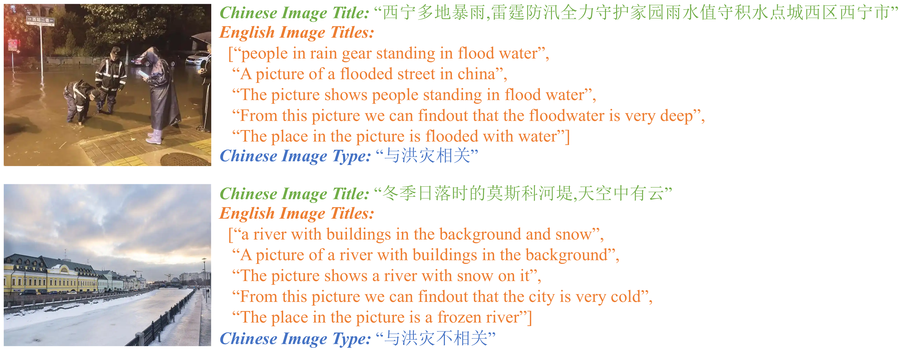

# SLIP-Flood: Soft-combination of Swin Transformer and Lightweight Language-Image Pre-training for Flood Images Classification

## Project Intruction


The goal of this project is to develop a vision-language cross-modal pre-training model suitable for multiple downstream tasks in the field of flood monitoring, such as image-text classification and image-text retrieval. Additionally, the project aims to build two large-scale, open-source vision-language datasets tailored for the flood monitoring domain.

The project is named **SLIP-Flood**, consisting of two modules: [FICM](#FICM) and [FTIRM](#FTIRM). **FICM** is responsible for the flood image classification task, while **FTIRM** handles flood image-text retrieval, auxiliary flood image classification, and auxiliary flood text classification tasks.

This project will ultimately release two types of open-source vision-language datasets: **FloodMulS** and **FloodIT**. Detailed descriptions of the datasets can be found in the section [Dataset](#Dataset).

## Dataset
### FloodMulS

The dataset **FloodMulS** is used to train the **FICM** module in **SLIP-Flood**. It can be accessed via the [download link](https://www.kaggle.com/datasets/muhantang/floodmuls-and-floodit/data).


**FloodMulS** includes 465,000 images, with 455,000 images in the training dataset and 10,000 images in the test dataset.

In the training dataset, 25% of the images are augmented. This project uses six types of data augmentation techniques: random cropping, brightness adjustment, contrast adjustment, color jittering, adding Gaussian noise, and adding salt-and-pepper noise. Each image randomly undergoes one of these augmentation methods. An example is shown below:


### FloodIT

The dataset **FloodIT** is used to train the **FTIRM** module in **SLIP-Flood**. It can be accessed via the [download link](https://www.kaggle.com/datasets/muhantang/floodmuls-and-floodit/data).

**FloodIT** includes 237,000 image-text pairs, where each pair consists of: 1 image, 1 Chinese description title, 1 Chinese category label, and 5 English description texts. Therefore, **FloodIT** can be expanded into 1,185,000 image-text pairs. Additionally, this project has constructed 10,000 image-text pairs for testing the model's performance, with each test pair containing: 1 image, 1 Chinese description title, and 1 Chinese category label. An example is shown below:



## Environment Setup

Before installing the project environment, please make sure you have the following:Python environment、Conda environment (optional)、Python compiler (default: Visual Studio Code)

1. Enter the project root directory.
```
    cd ./   
```
2. Create a new environment.
```
    conda create --name SLIP-Flood python==3.9
    conda activate SLIP-Flood
```

3. Install CUDA, PyTorch, and other deep learning environments. For reference, visit the [official PyTorch website](https://pytorch.org/).
```
    # The default CUDA version is 12.4.
    conda install pytorch torchvision torchaudio pytorch-cuda=12.4 -c pytorch -c nvidia
```
4. Install the required third-party libraries.
```
    pip install -r requirements.txt
```

## Project file description.

This project is divided into two modules: **FICM** and **FTIRM**. Below is a detailed description of the project files for both modules.

### FICM

All files for this module are located in the path `/FICM`. Unless otherwise specified, all paths in this section are relative to the root directory `/FICM`.

1. `./data/`
Used to store various data required by **FICM**, including:
    - `./flood_forTrain`：Training dataset, where `flood_is` stores images labeled as "related to flooding," and `flood_no` stores images labeled as "not related to flooding."
    - `./flood_forTest`：Testing dataset, where `images_all` stores all images used for testing, `predict_is` stores images predicted by the model as "related to flooding," and `predict_no` stores images predicted by the model as "not related to flooding."
    - `./predict`：Stores images for model inference, where `images_all` stores all images used for inference, `flood_is` stores images predicted by the model as "related to flooding," and `flood_no` stores images predicted by the model as "not related to flooding."
    - `./golden_label.txt`：The ground truth labels for the images.

2. `./models/`
Used to store pre-trained models of various scales for SwinT, which can be downloaded from the following link: [SwinT](https://github.com/microsoft/Swin-Transformer).

3. `./weights/`
Used to store the pre-trained models obtained from training the **FICM** module.

4. 脚本/文件说明
   - `./do_train.py`：Training script [To be released]
   - `./do_test.py`：Testing script [To be released]
   - `./do_predict.py`：Inference script [To be released]
   - `./models.py`：Encapsulated model framework [To be released]
   - `./utils.py`：Utility functions [To be released]
   - `./data_augmentation.py`：Data augmentation
   - `./analyse_is_no_score.py`：Visualizes various metrics based on the category probability values of the images in the test set inferred by the model, and determines the optimal classification threshold using Soft Categorization Strategy
   - `./class_indices.json`：Indexes corresponding to image categories

### FTIRM

All files of this module are located in the path `/FTIRM`. Except for special instructions, all paths in this section are relative to `/FTIRM` as the root directory.

1. `./checkpoints/`
Used to store the pre-trained models obtained from training the **FTIRM** model.

2. `./data/`
Used to store various types of data required by **FTIRM**, including:
    - `./images`：Used to store image data for different functions. `train` contains the training dataset, `test` contains the testing dataset, `predict` contains 10,000 images for model testing, `flood_is` contains images from `predict` classified as "flood-related," `flood_no` contains images from `predict` classified as "not flood-related," `predict-is` contains images predicted by the model as "flood-related," and `predict-no` contains images predicted by the model as "not flood-related."
    - `images_all`：Stores all images corresponding to the **FloodIT** dataset.

3. The tsv files in `./data/`.
    - `./example_predict-label.tsv`：10,000 images in `predict` and their Chinese labels.
    - `./example_predict-title.tsv`：10,000 images in `predict` and their Chinese titles.
    - `./example_test-label.tsv`： All images in `test` and their Chinese labels.
    - `./example_test-label.tsv`：All images in `test` and their Chinese titles.
    - `./example_train-label.tsv`：All images in `train` and their Chinese labels.
    - `./example_train-label.tsv`：All images in `train` and their Chinese titles.
  
4. `./models/`
Stores the pre-trained models used to initialize the image encoder and text encoder in **FTIRM**.
    - `./chinese-roberta-wwm-ext`： Initializes the text encoder, with a model size of base.
    - `./chinese-roberta-wwm-ext-large`：Initializes the text encoder, with a model size of large.
    - `./vit-large-patch16-224`：Initializes the image encoder, with a model size of large.

5. `./result/`
Stores the test results of various models.

6. Script Description
   - `./train.py`：Training script [To be released]
   - `./model.py`：Model script [To be released]
   - `./imageClassify.py`：Image classification script [To be released]
   - `./imageRetrieve.py`：Image-text retrieval script [To be released]
   - `./textClassify.py`：Auxiliary text classification script [To be released]
   - `./analyse_is_no_score.py`：Analyzes the probability values of each image category predicted by the model.
